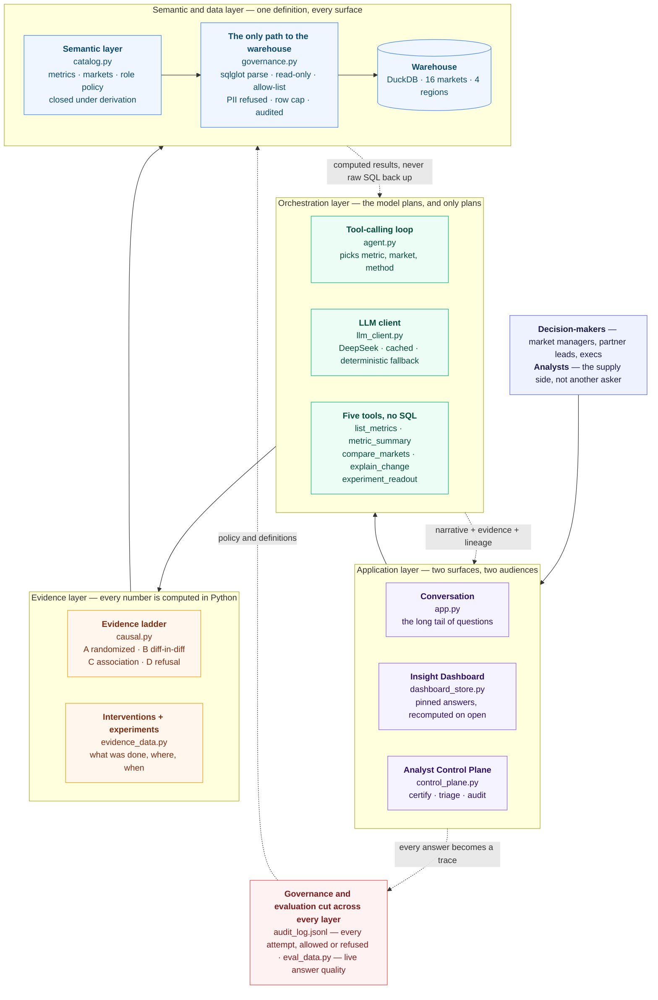

# Insight Copilot — Architecture

How a plain-language question becomes an answer someone is allowed to act on, and how the
product learns from every answer it has already given.

Two diagrams carry the whole argument:

1. **[The stack](#1-the-stack)** — where a question travels, and what each layer is
   permitted to decide.
2. **[The evaluation loop](#2-the-evaluation-loop)** — how a bad answer becomes a permanent
   regression test instead of a support ticket.

---

## 1. The stack

Four layers, and one concern that cuts across all of them. The layering exists to enforce a
single rule: **the model chooses, the platform computes.** No layer below is allowed to
trust free text from the layer above.

### What each layer is allowed to decide

| Layer | Decides | Explicitly cannot |
|---|---|---|
| Application | What to show, what to pin | Compute a metric of its own |
| Orchestration | Which metric, which market, which method | Write SQL, or state a number |
| Evidence | Whether the data supports a causal claim | Overrule a refusal to make an answer nicer |
| Semantic + data | What a metric *means*, and who may see it | Be bypassed — there is no second path to the warehouse |

**Why the tools take no SQL.** The model calls `explain_change(metric_id, market)`, and the
catalog supplies the query. Estimates, intervals, p-values and assumption tests all come
from `causal.py`. The model narrates a verdict it did not compute — that division is the
entire safety argument.

**Why governance is parsing, not pattern-matching.** Every query is parsed with `sqlglot`
before execution: read-only, single statement, allow-listed tables, PII refused for every
role including Analyst, row cap imposed, every attempt written to the audit log.

**Why role policy is closed under derivation.** ROAS = bookings ÷ spend, so a role granted
ROAS *and* bookings can derive spend by division. `catalog.close_policies()` detects that
implication and makes the grant explicit rather than pretending the data is withheld.

---

## 2. The evaluation loop

Answer quality is a production property, not a launch checklist. The loop below is what
turns a single bad answer into a fix that reaches every future answer.

```mermaid
flowchart LR
    trace["<b>Every answer traced</b><br/>question · plan · SQL · rows<br/>answer · latency · cost<br/><i>no sampling at this stage</i>"]
    select["<b>Selected for review</b><br/>a random sample, plus<br/>every thumbs-down and<br/>every refusal"]
    judge["<b>Judge + human panel</b><br/>grounded · calibrated · helpful<br/><i>humans score a fixed slice so<br/>the judge itself is calibrated</i>"]
    taxonomy["<b>Failure taxonomy</b><br/>definition · retrieval ·<br/>routing · narration —<br/>each has a different owner"]
    fix["<b>The fix, by owner</b><br/>analyst certifies a definition,<br/>or the team fixes a tool,<br/>prompt, or retrieval corpus"]
    golden["<b>Golden set updated</b><br/>the failure becomes a<br/>permanent regression case<br/>with an expected answer"]
    ci["<b>CI gate before deploy</b><br/>prompt, tool and definition<br/>changes all run the set —<br/>no silent regressions"]

    trace --> select --> judge --> taxonomy
    taxonomy -- "routed by type" --> fix
    fix --> golden --> ci
    ci -- "the fix reaches every future answer,<br/>not one ticket for one person" --> trace

    classDef step fill:#ffffff,stroke:#94a3b8,color:#0f172a
    classDef judgec fill:#f3e8ff,stroke:#a855f7,stroke-width:2px,color:#3b0764
    classDef fixc fill:#ecfeff,stroke:#0e7490,stroke-width:2px,color:#164e63
    class trace,select,taxonomy step
    class judge judgec
    class fix,golden,ci fixc
```

### The four claims this loop makes

**Tracing is not sampled.** Sampling happens at *review*, not at capture. A failure you
never recorded is a failure you cannot reproduce.

**Selection is biased on purpose.** A random sample alone under-weights the answers that
matter. Every thumbs-down and every refusal enters review, because a refusal can be
correct-but-useless — the trace log is full of them: *"Policy refusal correct, but gave no
route to request access."*

**The judge is a model, so it is itself under test.** Three dimensions — `grounded`,
`calibrated`, `helpful` — with humans scoring a fixed slice to calibrate the judge. Until
that calibration exists, judge scores are a signal, not a gate. The UI says so.

**A failure has an owner.** The taxonomy exists to route, not to describe. A wrong metric
*definition* is an analyst's job in the Control Plane; a wrong *routing* decision is a
prompt or tool fix. Sorting these is what stops the eval loop from becoming a bug backlog
nobody owns.

The payoff is the return edge. A ticket fixes one answer for one person; a golden-set case
plus a CI gate fixes the class of answer for everyone, permanently.

---

## Reading the two together

The stack decides **what the product is allowed to say**. The loop decides **whether it
should have said it**. Neither is sufficient alone: governance without evaluation ships a
system that is safe and unhelpful; evaluation without governance measures a system that was
never constrained in the first place.

### Honest limitations

- Data is synthetic. The story it carries — a paid-search cut in Rome, with untreated
  control markets — is planted so the causal engine has something real to find.
- Standard errors are classical, not clustered by market.
- The judge needs calibrating against human labels before its scores should drive decisions.
- The golden set and CI gate are the designed loop; what ships in this prototype is the
  trace, sampling and scoring end of it.
- Experiment scorecards are a mocked read of a platform that would be owned elsewhere.
  Integrating rather than rebuilding is the deliberate call.
