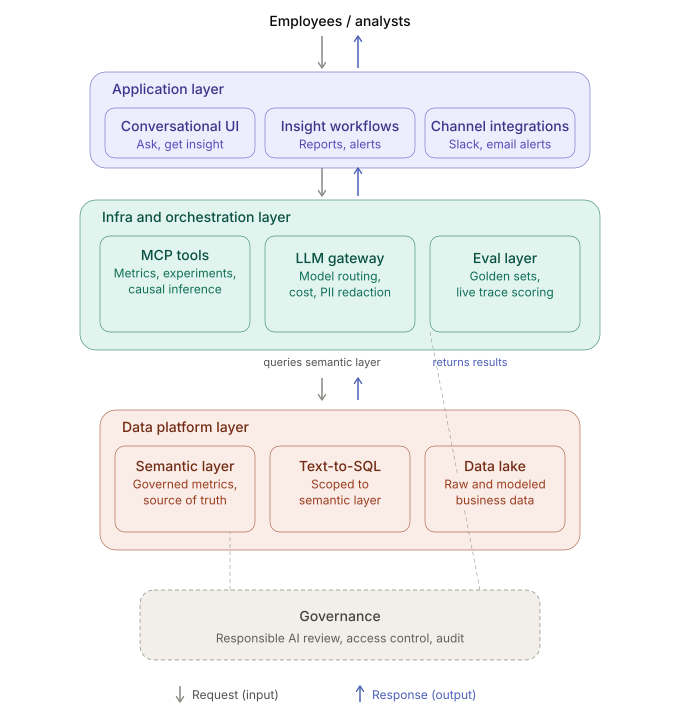

# Insight Copilot — Architecture

Two diagrams: where a question travels, and how the product learns from every answer it has
already given.

---

## The stack

Employees enter through the application layer and never touch the layers below it. The
orchestration layer plans; it does not compute. Every query resolves through the semantic
layer, which is the only path to the data lake — text-to-SQL is scoped to it rather than
turned loose on raw tables. Governance spans the infra and data layers because access
control and audit are not a step in the flow, they are a property of it.

---

## The evaluation harness

Answer quality is a production property, not a launch checklist. Tracing is not sampled —
sampling happens at review. Selection is biased on purpose: every thumbs-down and every
refusal enters review alongside the random sample. The judge is itself a model, so humans
score a fixed slice to calibrate it. The taxonomy exists to route, not to describe: a wrong
metric definition is an analyst's job, a wrong routing decision is a prompt or tool fix.

The payoff is the return edge. A ticket fixes one answer for one person; a golden-set case
behind a CI gate fixes the class of answer for everyone.
